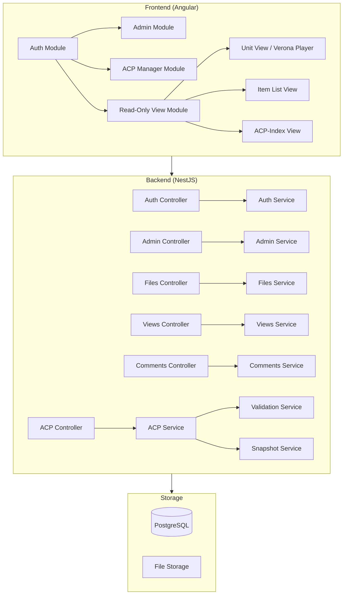
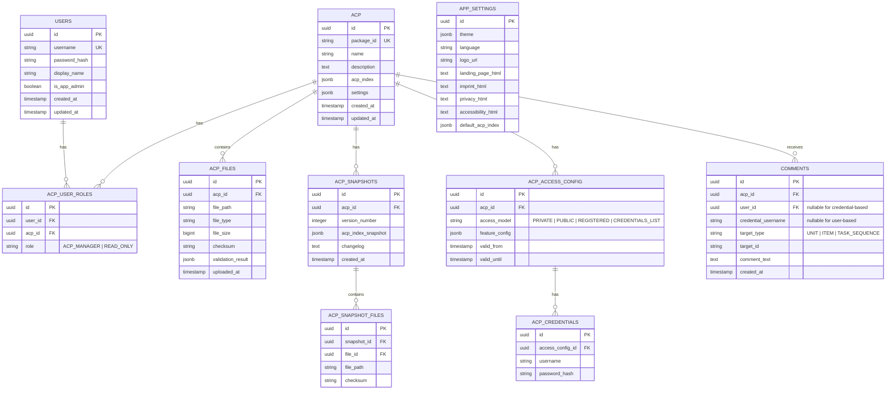
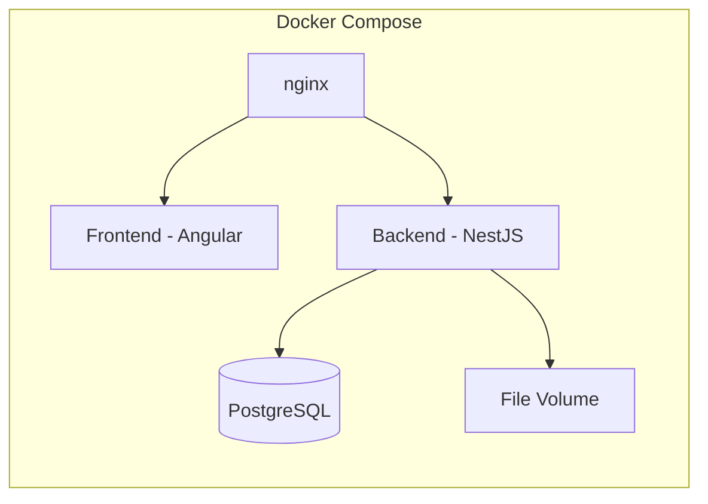

# IQB ContentPool - Implementation Plan

## Project Overview

The **IQB ContentPool** is a web application for managing **Assessment Content Packages (ACPs)** — bundles of data required to conduct and evaluate educational assessments (Lernstandserhebungen / learning assessments and surveys). The application serves as a central hub for storing, versioning, validating, and sharing assessment content across institutions.

> [!IMPORTANT]
> **Source Documentation**: [ContentPool Overview](https://iqb-berlin.github.io/rising-stars/content-pool/) | [ACP-Manager](https://iqb-berlin.github.io/rising-stars/content-pool/acp-manager.html) | [ACP-Views](https://iqb-berlin.github.io/rising-stars/content-pool/acp-views.html) | [ACP-Index Schema](https://iqb-specifications.github.io/acp-index/)

---

## User Review Required

> [!IMPORTANT]
> **Technology Stack Decision**: The plan below proposes **NestJS (backend)** + **Angular (frontend)** + **PostgreSQL (database)** – matching IQB's existing ecosystem (Testcenter, Studio). Please confirm or specify different preferences.

> [!WARNING]
> **Scope Clarification Needed**:
> 1. Should the prototype target **all 5 usage scenarios**, or should we prioritize a subset for the mid-2026 prototype?
> 2. The spec mentions **Verona-Player integration** for displaying units. Do you have a specific player module/version to integrate, or should we stub this out initially?
> 3. For server-to-server communication (Zwischenspeicher/Backup scenario), should this be part of the prototype or deferred?
> 4. Are there existing IQB design system components/libraries to reuse for the frontend?

---

## Architecture Overview



---

## Data Model

### Database Schema (PostgreSQL)



---

## Implementation Phases

### Phase 1: Foundation & Core Data Management

> Goal: Set up project structure, authentication, user management, and basic ACP CRUD operations.

---

#### Backend Foundation

##### [NEW] `backend/` — NestJS Application

| File / Module | Purpose |
|---|---|
| `src/main.ts` | Application bootstrap with CORS, validation pipes |
| `src/app.module.ts` | Root module with TypeORM, JWT, config |
| `src/config/` | Environment config, database config |
| `src/database/` | TypeORM entities, migrations |

##### [NEW] `src/auth/` — Authentication Module

| File | Purpose |
|---|---|
| `auth.module.ts` | JWT strategy, passport config |
| `auth.controller.ts` | `POST /auth/login`, `POST /auth/logout`, `GET /auth/profile` |
| `auth.service.ts` | JWT token generation, validation, password hashing |
| `jwt.strategy.ts` | Passport JWT strategy |
| `guards/` | `JwtAuthGuard`, `RolesGuard`, `AcpAccessGuard` |

##### [NEW] `src/users/` — User Management Module

| File | Purpose |
|---|---|
| `users.controller.ts` | CRUD for users (App-Admin only) |
| `users.service.ts` | User creation, role assignment |
| `entities/user.entity.ts` | User TypeORM entity |

##### [NEW] `src/acp/` — ACP Core Module

| File | Purpose |
|---|---|
| `acp.controller.ts` | CRUD for ACPs, ACP-Index upload/download |
| `acp.service.ts` | ACP lifecycle management |
| `entities/acp.entity.ts` | ACP TypeORM entity |
| `entities/acp-user-role.entity.ts` | Role assignment entity |
| `dto/` | Create/Update DTOs with validation |

---

#### Frontend Foundation

##### [NEW] `frontend/` — Angular Application

| File / Module | Purpose |
|---|---|
| `src/app/` | Root module, routing |
| `src/app/core/` | Auth service, interceptors, guards |
| `src/app/shared/` | Common components, pipes, directives |

##### [NEW] `src/app/auth/` — Auth Module

| Components | Purpose |
|---|---|
| `login/` | Login page for registered users |
| `credential-login/` | Login page for ACP credential-based access |

##### [NEW] `src/app/admin/` — Application Admin Module

| Components | Purpose |
|---|---|
| `settings/` | App settings (theme, texts, logo, defaults) |
| `users/` | User list, create, delete, assign App-Admin role |
| `acp-list/` | Create, delete, rename ACPs; assign ACP-Manager roles |

---

### Phase 2: File Management, Validation & Versioning

> Goal: Implement file upload/download, syntactic & semantic validation, and snapshot/versioning system.

---

##### [NEW] `src/files/` — File Management Module

| File | Purpose |
|---|---|
| `files.controller.ts` | Upload, download, delete files for an ACP |
| `files.service.ts` | File storage, checksum computation |
| `entities/acp-file.entity.ts` | File metadata entity |

##### [NEW] `src/validation/` — Validation Module

| File | Purpose |
|---|---|
| `validation.service.ts` | Orchestrates syntactic + semantic validation |
| `syntactic-validator.ts` | Validates files against format specifications |
| `semantic-validator.ts` | Validates cross-references (e.g., unit IDs in booklets exist in ACP) |
| `validators/` | Format-specific validators (JSON schema, XML schema, etc.) |

##### [NEW] `src/snapshots/` — Versioning/Snapshot Module

| File | Purpose |
|---|---|
| `snapshots.controller.ts` | Create snapshot, list snapshots, restore snapshot, diff |
| `snapshots.service.ts` | Snapshot creation (copy ACP-Index + file references), restore, changelog generation |
| `entities/snapshot.entity.ts` | Snapshot metadata entity |
| `entities/snapshot-file.entity.ts` | Snapshot file reference entity |

##### Frontend — ACP Manager Module

| Components | Purpose |
|---|---|
| `acp-manager/dashboard/` | ACP overview, ACP-Index editor (forms) |
| `acp-manager/files/` | File list, upload, download, validation status |
| `acp-manager/snapshots/` | Snapshot list, create, restore, diff view |
| `acp-manager/access-config/` | Configure read-only access (public/registered/credentials) |

---

### Phase 3: Read-Only Views, Player Integration & Comments

> Goal: Implement all read-only usage scenarios with Verona player integration and commenting.

---

##### [NEW] `src/views/` — Public/Read-Only Views Module

| File | Purpose |
|---|---|
| `views.controller.ts` | Endpoints for landing page, ACP list, task sequences, units, items |
| `views.service.ts` | Builds view data respecting access config and feature flags |

##### [NEW] `src/comments/` — Comments Module

| File | Purpose |
|---|---|
| `comments.controller.ts` | Create, list, download (XLSX) comments |
| `comments.service.ts` | Comment management, XLSX export |
| `entities/comment.entity.ts` | Comment entity |

##### Frontend — Read-Only View Module

| Components | Purpose |
|---|---|
| `views/landing/` | Public landing page with ACP list |
| `views/acp-start/` | ACP start page with links to sequences, units, items |
| `views/task-sequence/` | Task sequence view with navigation (prev/next), unit list popup |
| `views/unit-view/` | Unit display via Verona player (run-review mode), page navigation |
| `views/item-view/` | Item view = unit view + scroll to item + highlight |
| `views/acp-index-view/` | Interactive ACP-Index browser |
| `views/metadata-panel/` | Side panel for metadata, coding scheme, RichText |
| `views/comment-dialog/` | Comment input dialog |

---

### Phase 4: Item Lists, Server API & Polish

> Goal: Item list with sorting/filtering/tagging, server-to-server API, and production readiness.

---

##### [NEW] `src/items/` — Items Module

| File | Purpose |
|---|---|
| `items.controller.ts` | Item list with filtering, sorting, tagging |
| `items.service.ts` | Extract items from ACP, aggregate metadata |

##### Frontend — Item List

| Components | Purpose |
|---|---|
| `views/item-list/` | Sortable, filterable item table with metadata columns |
| `views/item-list/tag-manager/` | Tag assignment UI |

##### [NEW] `src/api/` — Server-to-Server API Module

| File | Purpose |
|---|---|
| `api.controller.ts` | REST endpoints for external applications (Studio, Testcenter, Kodierbox) |
| `api.service.ts` | ACP transfer (bidirectional), listing available ACPs |

---

## Key Technical Decisions

### 1. ACP-Index Storage
The ACP-Index is stored as **JSONB** in PostgreSQL. This allows:
- Direct JSON import/export as specified
- Schema validation against `acp-index@0.5` on upload
- Querying nested data (units, items, instruments) via JSONB operators

### 2. File Storage
Files are stored on the **filesystem** (configurable path) with metadata in DB. This supports:
- Large file handling without DB bloat
- Efficient streaming for downloads
- Easy backup/migration

### 3. Snapshots
Snapshots use **copy-on-write** semantics:
- ACP-Index is deep-copied into the snapshot record
- Files are referenced (not duplicated) — only new/changed files after a snapshot get new storage
- Diff generation compares file checksums between snapshots

### 4. Access Control
Base access model with optional registered-user extension:
1. **Private**: Default for new ACPs; only app admins and assigned ACP users can open it
2. **Public**: No auth required, ACP listed on landing page
3. **Credentials List**: Separate username/password pairs, time-limited (max 3 months), listed on landing page with login prompt
4. **Registered User Extension**: Role-based access for assigned users can be combined with the base model

Options 1 to 3 are mutually exclusive as the base model. Option 4 can be combined with any base model.

### 5. Verona Player Integration
Units are displayed using a **Verona Player** loaded in an iframe. The player is loaded from the files stored in the ACP (dependency type `PLAYER`). The host application communicates with the player via the Verona API (`postMessage`).

---

## API Endpoints Overview

### Authentication
| Method | Endpoint | Auth | Description |
|--------|----------|------|-------------|
| POST | `/auth/login` | None | Login with username/password |
| POST | `/auth/credential-login` | None | Login with ACP credentials |
| GET | `/auth/profile` | JWT | Get current user profile |

### Admin (App-Admin only)
| Method | Endpoint | Description |
|--------|----------|-------------|
| GET/PUT | `/admin/settings` | App settings (theme, texts, defaults) |
| GET/POST/DELETE | `/admin/users` | User CRUD |
| PATCH | `/admin/users/:id/app-admin` | Toggle App-Admin role |
| POST | `/admin/acp` | Create new ACP |
| DELETE | `/admin/acp/:id` | Delete ACP |
| PATCH | `/admin/acp/:id/name` | Rename ACP |
| POST | `/admin/acp/:id/managers` | Assign ACP-Manager |

### ACP Management (ACP-Manager)
| Method | Endpoint | Description |
|--------|----------|-------------|
| GET/PUT | `/acp/:id/index` | Get/Update ACP-Index |
| GET | `/acp/:id/index/export` | Download ACP-Index as JSON |
| POST | `/acp/:id/index/import` | Upload/Replace ACP-Index |
| GET/POST/DELETE | `/acp/:id/files` | File management |
| GET | `/acp/:id/files/:fileId/download` | Download file |
| POST | `/acp/:id/files/upload` | Upload files |
| GET | `/acp/:id/files/:fileId/validation` | File validation result |
| POST | `/acp/:id/snapshots` | Create snapshot |
| GET | `/acp/:id/snapshots` | List snapshots |
| POST | `/acp/:id/snapshots/:snapshotId/restore` | Restore snapshot |
| GET | `/acp/:id/snapshots/:snapshotId/diff` | Diff with previous |
| GET/PUT | `/acp/:id/access` | Access configuration |
| POST | `/acp/:id/access/credentials` | Upload credentials list |
| GET/DELETE | `/acp/:id/comments` | Manage comments |
| GET | `/acp/:id/comments/export` | Export comments as XLSX |

### Read-Only Views (respects access config)
| Method | Endpoint | Description |
|--------|----------|-------------|
| GET | `/view/acp` | List accessible ACPs |
| GET | `/view/acp/:id` | ACP start page data |
| GET | `/view/acp/:id/index` | ACP-Index interactive data |
| GET | `/view/acp/:id/units` | Unit list |
| GET | `/view/acp/:id/units/:unitId` | Unit view data (player + definition) |
| GET | `/view/acp/:id/units/:unitId/metadata` | Unit metadata |
| GET | `/view/acp/:id/sequences` | Task sequences from booklets |
| GET | `/view/acp/:id/sequences/:seqId` | Sequence with ordered units |
| GET | `/view/acp/:id/items` | Item list with metadata |
| GET | `/view/acp/:id/items/:itemId` | Single item view data |
| POST | `/view/acp/:id/comments` | Create comment |
| GET | `/view/acp/:id/comments/mine` | Get own comments |
| GET | `/view/acp/:id/comments/export` | Export own comments as XLSX |

---

## Feature Configuration (per ACP)

The ACP-Manager can enable/disable these features for read-only access:

| Feature Flag | Description |
|---|---|
| `allowIndexDownload` | Download ACP-Index JSON |
| `allowUnitDownload` | Download units as ZIP |
| `allowFileDownload` | Download other ACP files |
| `enableUnitView` | View/play units via Verona Player |
| `showMetadata` | Show metadata alongside unit view |
| `showRichText` | Show RichText content (e.g., didactic guides) |
| `showCodingScheme` | Show coding scheme |
| `enableUnitListNavigation` | Navigate units from unit list |
| `enableSequenceNavigation` | Auto-generate task sequences from booklets |
| `enableCommenting` | Enable comments on units/items/sequences |
| `commentTargets` | Which entities can be commented: `UNIT`, `ITEM`, `TASK_SEQUENCE` |
| `enableItemList` | Generate and display item list |
| `metadataColumns` | Metadata column config for item list (`visible`, `order`) |
| `enableItemClick` | Navigate to item on click |
| `enableItemListFilter` | Allow filtering the item list |
| `enableItemListSort` | Allow sorting the item list |
| `enableItemListTags` | Allow tagging items |
| `availableTags` | List of available tag values |
| `persistUserPreferences` | Save sort/filter/tags per user (only with auth) |

---

## Deployment



| Component | Technology |
|---|---|
| Container | Docker + Docker Compose |
| Reverse Proxy | nginx |
| Frontend | Angular (served as static files) |
| Backend | NestJS (Node.js) |
| Database | PostgreSQL 16 |
| File Storage | Docker volume / host mount |

---

## Verification Plan

### Automated Tests

#### Backend
```bash
# Unit tests
cd backend && npm run test

# E2E tests
cd backend && npm run test:e2e

# Test coverage
cd backend && npm run test:cov
```

Key test areas:
- **Auth**: Login flows for private, public, credential, and role-based access paths; JWT validation; role guards
- **ACP CRUD**: Create, read, update, delete ACPs with proper authorization
- **File Management**: Upload, download, validation pipeline
- **Snapshots**: Create, restore, diff generation
- **Access Config**: Feature flag enforcement on view endpoints
- **Comments**: CRUD, XLSX export
- **ACP-Index Validation**: Schema validation against `acp-index@0.5`

#### Frontend
```bash
# Unit tests
cd frontend && npm run test

# E2E tests (Cypress or Playwright)
cd frontend && npm run e2e
```

### Manual Verification

> [!NOTE]
> Since this is a new application, manual testing should focus on end-to-end user journeys for each usage scenario. The following should be verified in a running instance:

1. **Admin Journey**: Login as admin → create users → create ACP → assign ACP-Manager role
2. **ACP-Manager Journey**: Login → select ACP → upload ACP-Index → upload files → verify validation feedback → create snapshot → configure read-only access
3. **Public Access**: Visit landing page → see public ACPs → browse units → navigate task sequences
4. **Authorized Download**: Login with credentials → download files
5. **Review/Comment**: Login → view task sequence → comment on units/items → export comments as XLSX

---

## Implementation Order (Recommended for AI Agent)

The agent should implement in this order, with each phase being **independently testable**:

| Order | Phase | Estimated Effort | Dependency |
|-------|-------|-------------------|------------|
| 1 | Project setup (Docker, NestJS, Angular, DB) | Small | None |
| 2 | Database schema + migrations | Small | Phase 1 |
| 3 | Auth module (JWT, guards, login) | Medium | Phase 2 |
| 4 | Admin module (users, settings) | Medium | Phase 3 |
| 5 | ACP CRUD + ACP-Index management | Medium | Phase 3 |
| 6 | File upload/download + validation | Large | Phase 5 |
| 7 | Snapshot/versioning system | Medium | Phase 6 |
| 8 | Access configuration | Medium | Phase 5 |
| 9 | Read-only view endpoints | Large | Phase 8 |
| 10 | Frontend: Auth + Admin pages | Medium | Phase 4 |
| 11 | Frontend: ACP Manager dashboard | Large | Phase 7 |
| 12 | Frontend: Read-only views + Verona Player | Large | Phase 9 |
| 13 | Comments system | Medium | Phase 9 |
| 14 | Item list (sort, filter, tags) | Medium | Phase 9 |
| 15 | Server-to-server API | Medium | Phase 9 |
| 16 | Docker Compose + deployment config | Small | All |
